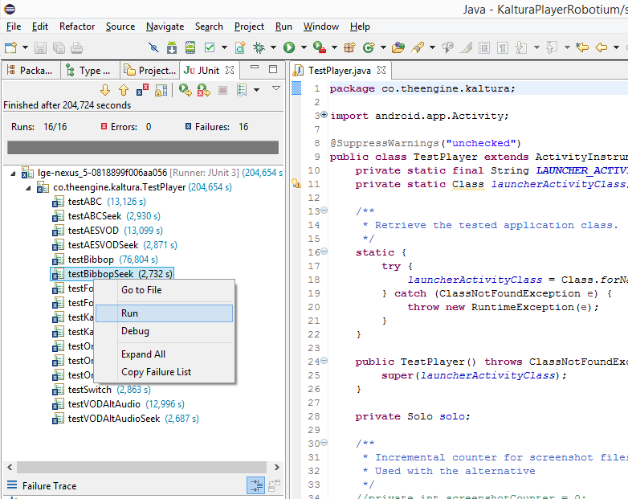

#Android Kaltura Robotium Tests

## Setup

Eclipse Luna 4.4.0 with Android Developer Tools 23.0.3.1327240 should be sufficient for running the tests on devices and/or emulators.

## Testing

After you File->Import the "Existing project into the workspace", you should be able to run it as an "Android JUnit Test":

It should ask you where to run the tests, make sure you have the Kaltura player installed on that device/emulator with the activity name being equal to the `LAUNCHER_ACTIVITY_FULL_CLASSNAME` constant in `TestPlayer.java`.

> **IMPORTANT NOTE**: Both the JUnit Robotium test and the Kaltura player have to be built using the same key/certificate, i.e. they have to be built on the same machine. If you get an already compiled Kaltura player apk from a different machine, you have to *re-sign* it with your own debug certificate and reinstall it on your device/emulator. This can be done using the **[re-sign tool](http://recorder.robotium.com/downloads/re-sign.jar)**. More info about this on the [Robotium wiki](https://code.google.com/p/robotium/wiki/RobotiumForAPKFiles).

After running, you should get a "JUnit" tab with all the tests listed, where you'll get status reports on each test as they're run and where you can Run or Debug each individual test as well:

